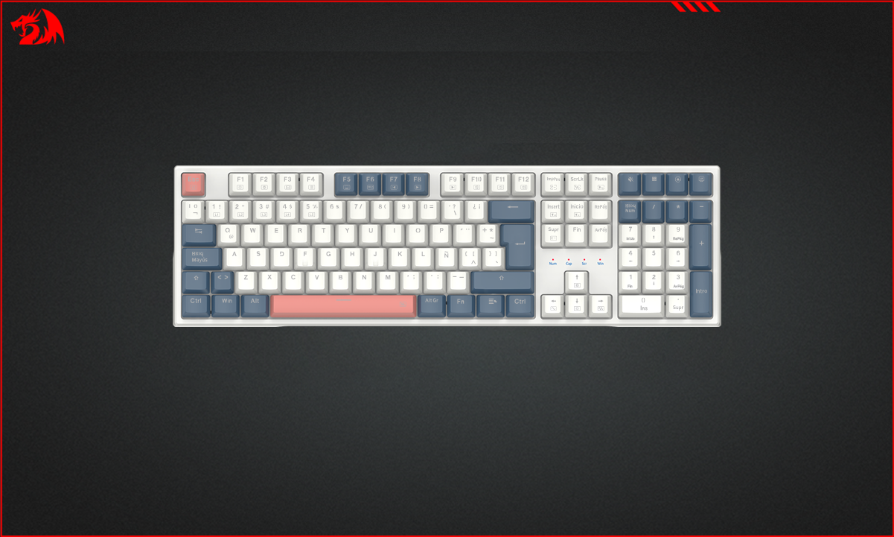
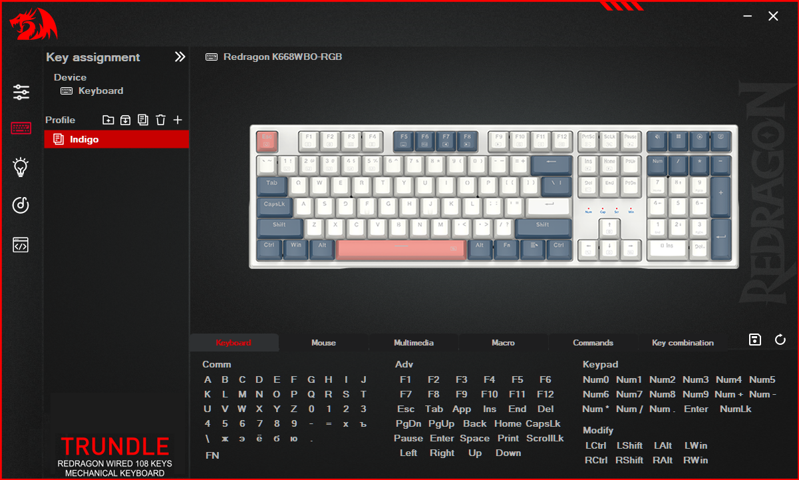
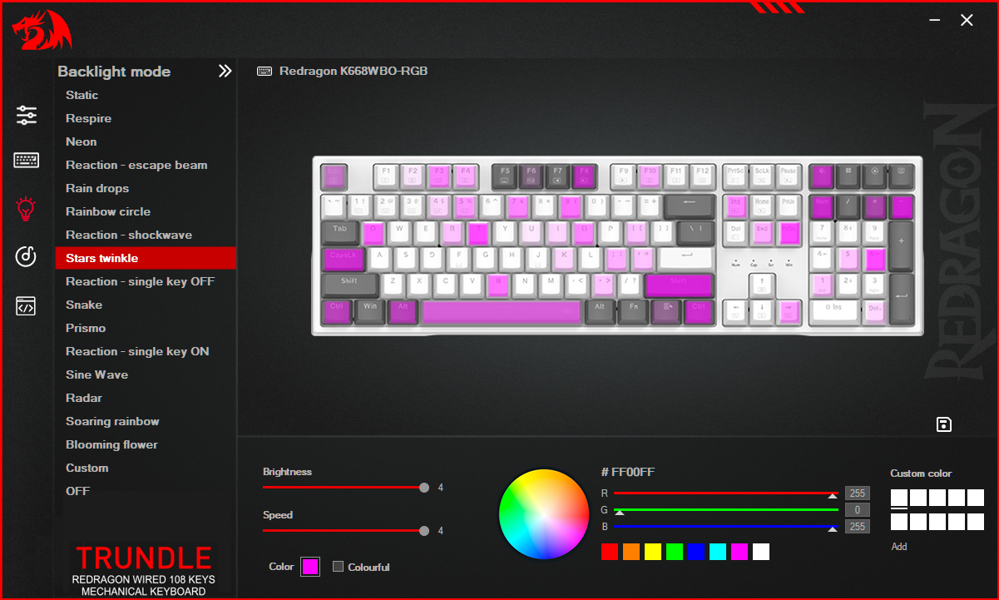
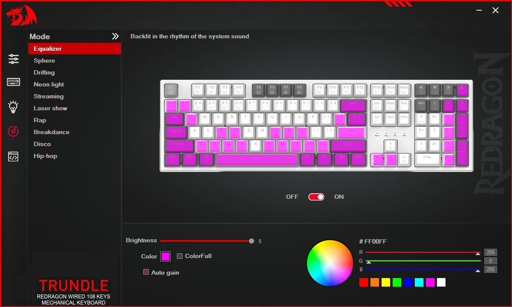

# Redragon K668 — US English Layout Software

This project is intended to bring an update of official driver for global version of Redragon [Trundle K668](https://redragonshop.com/blogs/product-download/trundle-k668) and [Whisper RGB](https://redragon.ru/catalog/keyboards/12839#files) keyboards *(regional names of K668)*, which was released only for German and Spanish layouts. Not affiliated with or sponsored by Redragon, we are not responsible for this software.

## Installation

Download this repository using Code button above or via a [direct link](https://github.com/rislaed/redragon-k668wbo-rgb/archive/refs/heads/main.zip). ZIP archive can be unpacked instead of previous version in `C:\Program Files (x86)\Redragon K668WBO-RGB` or any other folder, creating shortcuts to launch *OemDrv.exe* in desired locations.

Driver is based on the latest update for the German [v2.0 from July 8, 2025](https://cdn.shopify.com/s/files/1/0012/4957/4961/files/Redragon_K668-RGB-DE_Setup_v2.0_20250708.exe?v=1752481290).

## Known issues

- Even though application names have been renamed for regional version, status/window name will still be K668-RGB-DE.
- Do not try to apply settings when music mode is on, turn it off first, this is a common problem with v2.0.
- In order for backlight animations to be displayed in window, they must first be applied using a separate save button.
